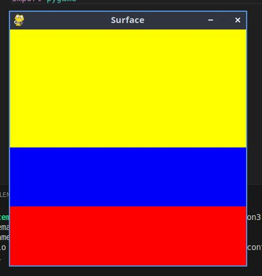

# intro_pygame
estructura de un juego en pygame
## inicializacion
como en todo programa en python , se debe importar los modulos  o librerias a utilizar


`import pygame`

- inicializar pygame usando la funcion init (). inicializa todos los modulos de pygame importados

`pygame.init()`

## visualisacion de la ventana

` ventana = pygame.display.set.mode((600,400))`


 - set mode () es la funcion encargada de definir el tamaño de la ventana , en el ejemplo ,se esta definiendo una ventana de 600 px de ancho , por 400 px de alto.

'pygame display.set_caption( 'mi ventana' )'

- set_caption() es la funcion que añade un titulo a la ventana.

### funcion set_mode()

`set_mode(size =(0,0), flags = 0 , depth = 0 , display=0)`

- size = (600,400) : define el tamaño de la ventana.

- flags: define  uno o mas comportamiento para l ventana.
    - valores:
    - pygame.FULLSCREEN
    - pygame.RESIZABLE
    ejemplo:
    - flags = pygame.FULLSCREEN pygame.
    REZISABLE : pantalla completa,
    dimensiones modificables.

# bucle del juego - game loop
- bucle infinito que se interrumpira al cumplir ciertos criterios

- reloj interno del juego
- en cada interaccion de bucle del juego podemos mover un personaje , o tener en cuenta que un objeto  a alcanzado a otro , o que se han cruzado la linea de de llegada quiere decir  que la partida ha terminado

-  en cada iteracio  es una oportunidad para actualizar tdos los datos relacionados con el estado actual de la partida 

- en cada iteraccion se realizan las siguientes tareas :
   1. comprobar que no se alcanzan las condiciones de parada , en cuyo caso se interrumpe el  bucle. 
   2. actualizar los recursos necesarios para la interaccion actual 
   3. obtener las entradas de sistemas , o de interracion del jugador 
   4. actualizar todas las identidades que caracterizan el juego 
   5. refrescar la pantalla
 

 # estructura de un juego en pygame 
 ## superficie pygame 
 - superficie:
     -elemento geometrico
     - linea , poligono , imagen , texto que se muestra en la pantalla 
     - el poligono se puede o no rellenar de color
     - las superficies se caen de diferentes manera dependiendo del tipo:
     - imagen : image.load()
     - texto : font.render()
     - superficie generica : pygame .surface()
     - ventana de juego : pygame .display.set_mode()


ejemplo de bandera de colombia 

```

# importamos la libreria pygames

import pygame


# inicializamos los modulos de pygame 

pygame.init()

# establecer titulo a la ventana 
pygame.display.set_caption("Surface")

# establecemos las dimensiones de la ventana 
ventana = pygame.display.set_mode((400,400))

# definimos un color 

amarillo= (255,255,0)

azul = (0,0,250)

rojo = (255,0,0)


# crear una superficie 

amarillo_Superficie = pygame.Surface((400,200))

azul_Superficie = pygame.Surface((400,100))

rojo_Superficie = pygame.Surface((400,100))


# rellenamos la superficie del color
amarillo_Superficie.fill(amarillo)
azul_Superficie.fill(azul)
rojo_Superficie.fill(rojo)


# inserto o muevo la ventana  la superficie en la ventana
ventana.blit(amarillo_Superficie, (0,0))
ventana.blit(azul_Superficie, (0,200))
ventana.blit(rojo_Superficie, (0,300))


# actualiza la visualizacion de la ventana 
pygame.display.flip()
# bucle del juego
while True: 
    event = pygame.event.wait()
    if event == pygame.QUIT: 
        break 

pygame.quit()

```



## gestion del tiempo y los eventos 

###  modulo time 
### modulo time

- este modulo ofrece varias funciones que permiten cronometrar la sesion actual (desde el init) o pausar, la ejecucion,por ejemplo:
- funciones:
     - pygame.time.get_ticks
     - pygame.time.waitpygame.time.delay

- Objeto clock
    - la funcion tick permite actulizar el  reloj asociado con el juego actual.
    - se llama cada vez que se actualiza la pantalla del juego.
    - permite especificar el numero maximo de fotogramas que se muestran por segundo,y por lo tanto,limitar y controlar la velocidad de ejecucion del juego.
    - si insertamos en un bucle de juego la siguiente linea, garantizamos que nunca se ira mas rapido de 50 fotogramas por segundo: `Clock.tick(50)`

### gestion de eventos 
- hay diferentes formas para que el programa sepa que se ha desencadenado un evento.
- es esencial que los programas puedan conocer inmediatamente las acciones del jugador  a traves del teclado , el mouse , un joystick 

#### funcion pygame .event.get
- permite obtener todos los eventos  en espera de ser procesados y que estan dispponibles en una cola 
si no hay ninguno , entonces se obtiene una coleccion vacia 

```python 
# usamos un bucle for para recorrer todos los eventos de la eleccion obtenida 
for event in pygame.event.get():
    if event.type == pygame.keydown:
        if event.key == pygame.k_escape:
            PARAR_JUEGO true
```
### funcion pygame.event.wait
- esta funcion espera que ocurra un evento , y en cuanto sucede esta accion  
